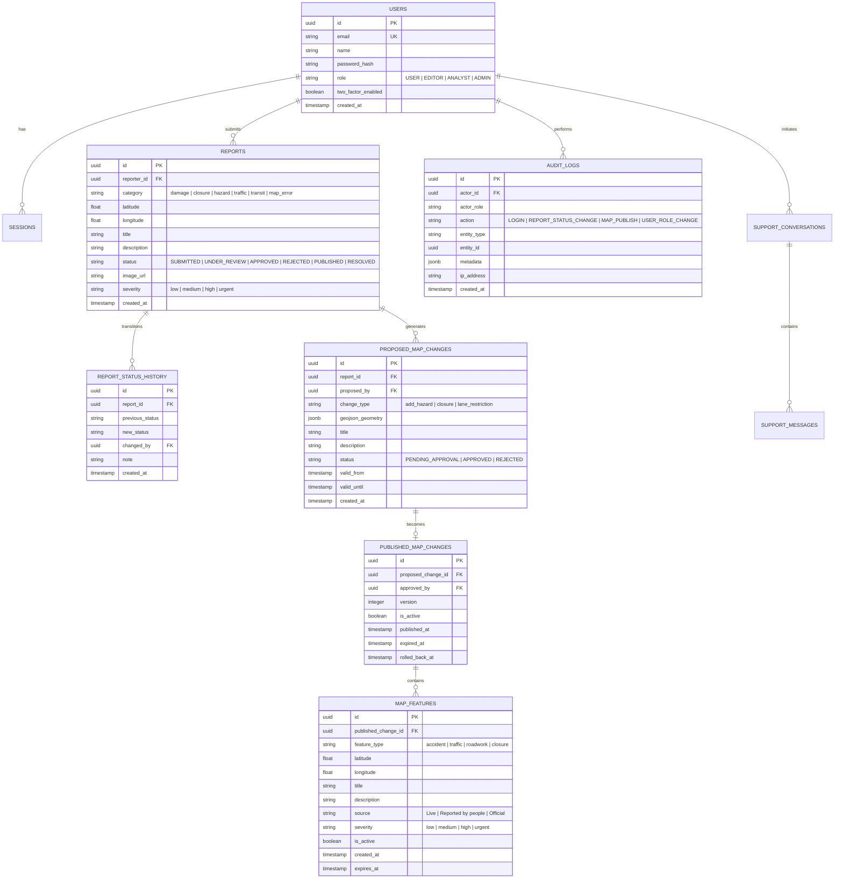

# Database Schema & Data Models

## 1. Relational Entity-Relationship Overview

```mermaid
erDiagram
    USERS ||--o{ SESSIONS : has
    USERS ||--o{ REPORTS : submits
    USERS ||--o{ AUDIT_LOGS : performs
    REPORTS ||--o{ REPORT_STATUS_HISTORY : transitions
    REPORTS ||--o{ PROPOSED_MAP_CHANGES : generates
    PROPOSED_MAP_CHANGES ||--o| PUBLISHED_MAP_CHANGES : becomes
    PUBLISHED_MAP_CHANGES ||--o{ MAP_FEATURES : contains
    USERS ||--o{ SUPPORT_CONVERSATIONS : initiates
    SUPPORT_CONVERSATIONS ||--o{ SUPPORT_MESSAGES : contains

    USERS {
        uuid id PK
        string email UK
        string name
        string password_hash
        string role "USER | EDITOR | ANALYST | ADMIN"
        boolean two_factor_enabled
        timestamp created_at
    }

    REPORTS {
        uuid id PK
        uuid reporter_id FK
        string category "damage | closure | hazard | traffic | transit | map_error"
        float latitude
        float longitude
        string title
        string description
        string status "SUBMITTED | UNDER_REVIEW | APPROVED | REJECTED | PUBLISHED | RESOLVED"
        string image_url
        string severity "low | medium | high | urgent"
        timestamp created_at
    }

    REPORT_STATUS_HISTORY {
        uuid id PK
        uuid report_id FK
        string previous_status
        string new_status
        uuid changed_by FK
        string note
        timestamp created_at
    }

    PROPOSED_MAP_CHANGES {
        uuid id PK
        uuid report_id FK
        uuid proposed_by FK
        string change_type "add_hazard | closure | lane_restriction"
        jsonb geojson_geometry
        string title
        string description
        string status "PENDING_APPROVAL | APPROVED | REJECTED"
        timestamp valid_from
        timestamp valid_until
        timestamp created_at
    }

    PUBLISHED_MAP_CHANGES {
        uuid id PK
        uuid proposed_change_id FK
        uuid approved_by FK
        integer version
        boolean is_active
        timestamp published_at
        timestamp expired_at
        timestamp rolled_back_at
    }

    MAP_FEATURES {
        uuid id PK
        uuid published_change_id FK
        string feature_type "accident | traffic | roadwork | closure"
        float latitude
        float longitude
        string title
        string description
        string source "Live | Reported by people | Official"
        string severity "low | medium | high | urgent"
        boolean is_active
        timestamp created_at
        timestamp expires_at
    }

    AUDIT_LOGS {
        uuid id PK
        uuid actor_id FK
        string actor_role
        string action "LOGIN | REPORT_STATUS_CHANGE | MAP_PUBLISH | USER_ROLE_CHANGE"
        string entity_type
        uuid entity_id
        jsonb metadata
        string ip_address
        timestamp created_at
    }
```
